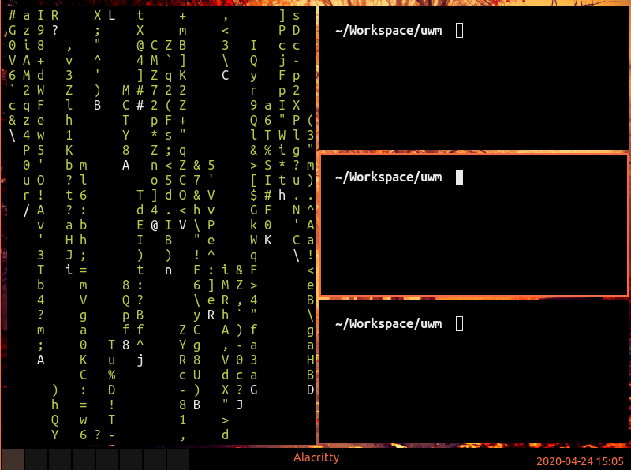

# UWM

X11 Tiling window manager written in zig.
Its still in a early stage but its "usable" :)



# Configuration

src/config.zig

Its currently my personal configuration.
Please make sure to adjust the fontname and the launch application.

## Autostart file

To set background, start applications etc.

~/.config/.uwm/autostart.sh

# Compile

```
make

zig build
```

# Run

```bash
# ~/.xinitrc
exec /path/to/uwm
```

# Run via Xephyr

```bash
make run
```

# Tests

```
make test

make watch
```

